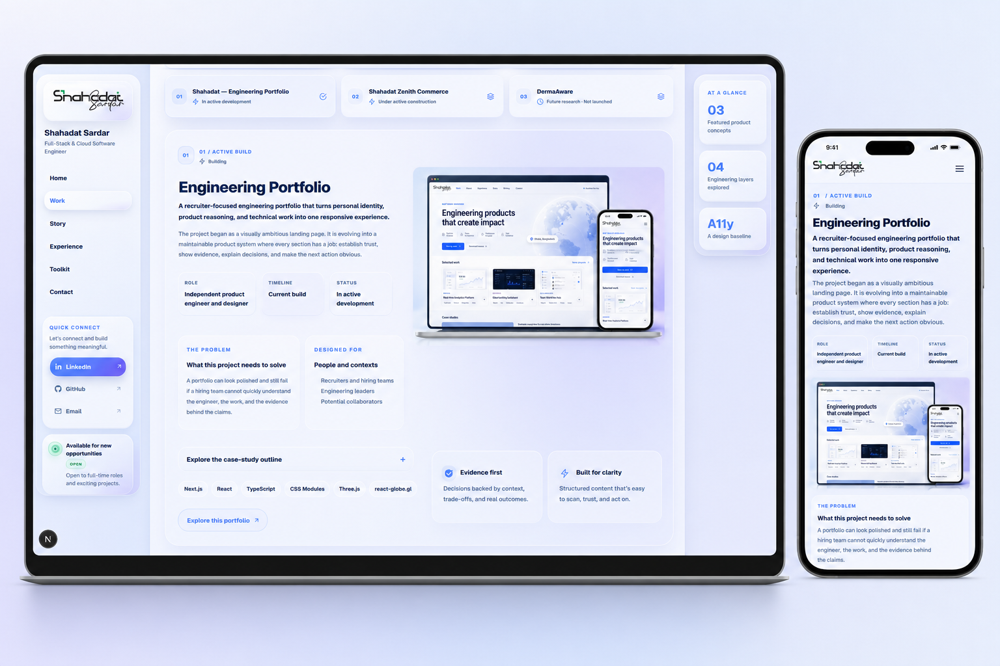

# Shahadat Sardar — Engineering Portfolio

A released, responsive engineering portfolio that makes product reasoning, implementation depth, and project boundaries easy to inspect.

> **Release status:** Production-ready portfolio · **Primary focus:** Full-stack and cloud software engineering · **Location:** Dhaka, Bangladesh

**Live product:** [shahadat-engineering-portfolio.vercel.app](https://shahadat-engineering-portfolio.vercel.app)

[](https://github.com/shahadat178/shahadat-portfolio/actions/workflows/quality.yml)



## Product brief

Many portfolios show polished screens but make it difficult to understand the engineer behind them: what they owned, why decisions were made, what is implemented, and what remains conceptual. This project turns those questions into a structured product experience for recruiters, engineering leaders, and potential collaborators.

The released site combines:

- evidence-led product case studies with explicit release states;
- technical decisions, delivery boundaries, and next-step records;
- a responsive shell for desktop, tablet, mobile, and browser zoom;
- accessible navigation, disclosures, focus states, and reduced-motion behavior;
- persistent appearance and desktop pointer preferences;
- an interactive Bangladesh-centered globe with a resilient non-WebGL fallback.

## Current product portfolio

| Product | State | Evidence boundary |
| --- | --- | --- |
| Shahadat — Engineering Portfolio | **Released** | Working product, documented decisions, and production verification |
| Shahadat Zenith Commerce | **Active build** | Full-stack architecture and implementation plan; no commercial results claimed |
| DermaAware | **Future research** | Non-diagnostic concept pending qualified clinical, privacy, safety, and inclusion review |

## Engineering highlights

### One responsive system

The desktop rails, compact layouts, mobile navigation, content hierarchy, and interaction states share one component and token system instead of separate device-specific replicas.

### Content separated from presentation

Typed portfolio data keeps project status, experience, toolkit, profile, and contact content independent from section components. This makes copy auditable and future case-study changes safer.

### Progressive enhancement for the globe

The globe provides the richer WebGL experience when the browser supports it and preserves the surrounding identity and location context when WebGL is unavailable.

### Honest evidence boundaries

Released work, active implementation, proposed technologies, and future research are labelled separately. The portfolio does not invent employment, adoption, revenue, clinical, or hiring outcomes.

### Production-safe delivery

The deployment manifest excludes source-control internals, local environments, editor state, build caches, and repository-only guidance. Production responses also remove framework branding and apply baseline content, framing, referrer, and browser-permission headers.

## Architecture

```text
app/page.tsx
└── PortfolioPage (client orchestration)
    ├── Portfolio shell
    │   ├── desktop navigation rail
    │   ├── sticky command bar
    │   ├── evidence and pointer rail
    │   └── mobile navigation sheet
    ├── Product sections
    │   ├── hero + interactive globe
    │   ├── selected work + case-study disclosures
    │   ├── engineering depth, story, and build log
    │   ├── principles, technical toolkit, and credentials
    │   └── contact + release footer
    └── Preferences
        ├── theme and appearance persistence
        ├── desktop pointer modes
        └── reduced-motion and capability checks
```

## Technology

- **Application:** Next.js 16 App Router, React 19, TypeScript
- **Presentation:** CSS Modules, shared liquid-glass tokens, Geist typography
- **3D identity visual:** Three.js through `react-globe.gl`
- **Icons:** React Icons
- **Delivery:** Vercel production deployment

## Repository map

```text
app/                    App Router entry points, metadata, and global foundations
components/cursor/      Optional desktop pointer experiences
components/layout/      Desktop and mobile portfolio shell
components/portfolio/   Client orchestration and responsive shell rules
components/sections/    Evidence-led product sections
data/                   Typed portfolio content and navigation model
docs/                   Engineering standards and release discipline
hooks/                  Preferences and active-section behavior
styles/liquid-glass/     Shared tokens, themes, and glass primitives
public/                 Production brand, project, profile, and certificate assets
```

## Run locally

### Requirements

- Node.js 20.19 or newer
- npm 10 or newer

```bash
git clone https://github.com/shahadat178/shahadat-portfolio.git
cd shahadat-portfolio
npm install
npm run dev
```

Open [http://localhost:3000](http://localhost:3000).

Production: [https://shahadat-engineering-portfolio.vercel.app](https://shahadat-engineering-portfolio.vercel.app)

## Quality gate

Run the complete release gate:

```bash
npm run check
```

Or run each stage independently:

```bash
npm run lint
npm run typecheck
npm run build
```

The production build intentionally uses Webpack because the current remote Turbopack/PostCSS path can time out while processing the large global visual system. Development keeps the faster default Turbopack workflow.

## Accessibility and resilience

- semantic landmarks and labelled navigation;
- keyboard-visible focus states and practical touch targets;
- reduced-motion handling for non-essential transitions and cursor effects;
- responsive typography and layout checks across mobile, tablet, desktop, and browser zoom;
- WebGL capability handling without making the rest of the hero dependent on 3D rendering;
- personal phone information intentionally excluded from the public product.

## Content integrity

Project states and proposed technologies are labelled explicitly. DermaAware is a future product-research concept for general education and care-navigation support; it is not a diagnostic, treatment, emergency-assessment, or clinical-decision product.

## Contact

- Email: [shahadatsardar73@gmail.com](mailto:shahadatsardar73@gmail.com)
- LinkedIn: [linkedin.com/in/shahadat-sardar](https://www.linkedin.com/in/shahadat-sardar)
- GitHub: [shahadat178](https://github.com/shahadat178)

## Ownership

Designed and engineered by Shahadat Sardar. All rights reserved. Source is published for technical review; no reuse licence is granted unless stated separately.
